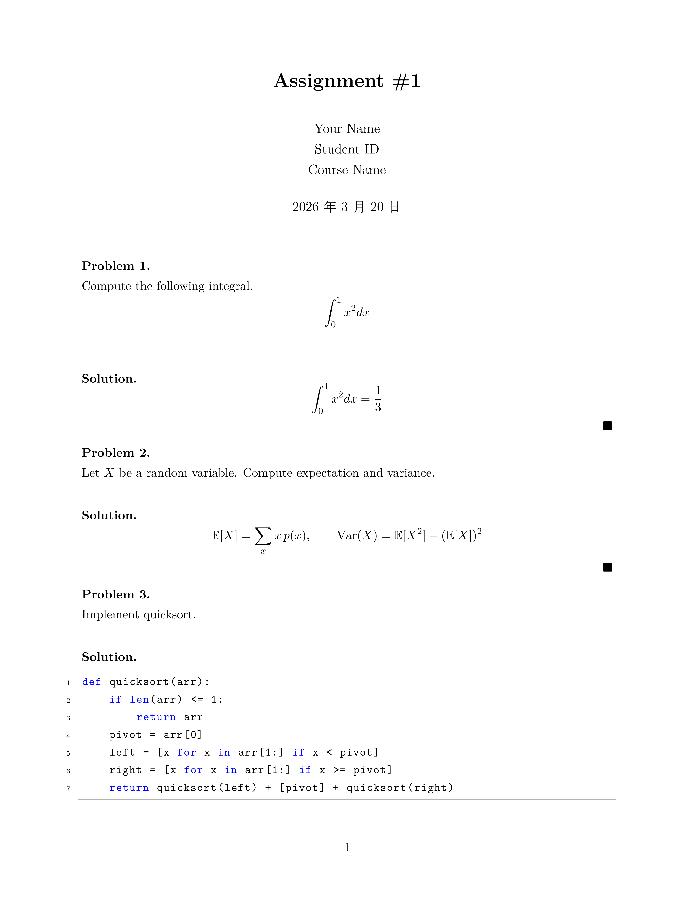
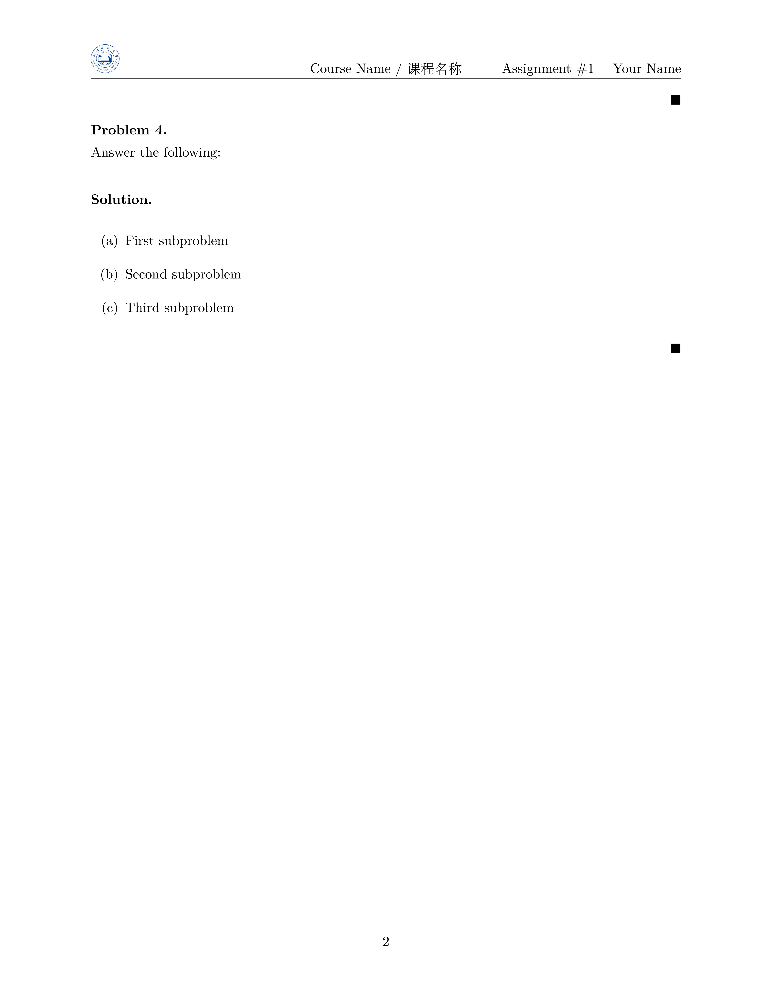

# HZNU-Assignment-Template


LaTeX 模板，专为杭州师范大学 (HZNU) 的数学、统计学、计算机科学和数据科学等学科作业设计。

## 功能特点

- **多学科支持**：适用于数学、统计学、计算机科学和数据科学等学科
- **中文支持**：内置 ctex 包，完美支持中文排版
- **数学公式**：集成 amsmath、amssymb、amsthm 等数学包
- **代码高亮**：支持 Python 等编程语言的代码高亮显示
- **自定义页眉**：包含学校 logo、课程名称和作业信息
- **问题-解决方案环境**：提供结构化的问题和解决方案环境

## 目录结构

```
HZNU-Assignment-Template/
├── LICENSE            # 许可证文件
├── README.md          # 项目说明文档
├── logo.png           # 学校 logo
└── main.tex           # 主模板文件
```

## 使用说明

### 1. 环境准备

使用[Overleaf](https://cn.overleaf.com/)平台编辑模板。

### 2. 定制模板

打开 `main.tex` 文件，根据你的需求修改以下内容：

- **课程信息**：修改第 23 行的课程名称
- **作业信息**：修改第 24 行的作业编号和你的姓名
- **个人信息**：修改第 72-74 行的姓名、学号和课程名称
- **作业内容**：在相应的 `problem` 和 `solution` 环境中填写你的作业内容

### 3. 编译文档

使用 LaTeX 编译器编译 `main.tex` 文件，生成 PDF 文档。
需要在`Setting`中设置 `XeLaTex`，以支持中文排版。

## 示例

模板中包含了以下示例：

1. **积分计算**：计算定积分 \int_0^1 x^2 dx 
2. **概率统计**：计算随机变量的期望和方差
3. **算法实现**：实现快速排序算法
4. **子问题示例**：展示如何处理包含多个子问题的作业

## 实例预览





## 许可证

本项目采用 MIT 许可证，详见 LICENSE 文件。

## 贡献

欢迎提交 Issue 和 Pull Request 来改进这个模板。

## 联系方式

如果有任何问题或建议，请通过 GitHub Issues 与我联系。
